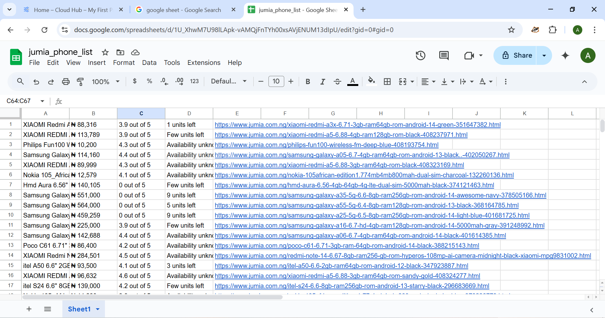

---

## 📱 Jumia Phone Tracker — Web Scraping Project

A data extraction tool built with **Scrapy** to crawl and collect mobile phone listings from [Jumia Nigeria](https://www.jumia.com.ng/mobile-phones/). The spider extracts structured product data and stores it into **MongoDB** for easy analysis and tracking, and **automatically exports it to a connected Google Sheet**.

---

### 🧰 Tech Stack

* **Scrapy** (Core framework)
* **MongoDB** (Data storage)
* **Google Sheets API** (Cloud sync)
* **Custom Middleware**
  * `RotateHeadersMiddleware` – Randomly rotates user agents and languages to avoid detection
* **AutoThrottle** – Manages crawl speed dynamically based on site response time

---

### 📦 Features

* ✅ Crawls up to 4 pages of mobile phone listings (configurable)
* ✅ Designed to **scale to more pages** — page limit set to 4 intentionally to:
  * Avoid hammering Jumia’s servers
  * Stay within ethical scraping limits
  * Keep test runs short during development
* ✅ Extracts:
  * Product title
  * Price
  * Rating
  * Stock availability
  * Product URL
* ✅ Skips products with missing data gracefully
* ✅ Saves data directly to MongoDB in a collection named after the spider
* ✅ Automatically exports each item to **Google Sheets**
* ✅ Logs pagination progress and crawl status

---

### 📤 Google Sheets Export (Cloud Sync)

Each scraped item is **immediately synced to a Google Sheet** using the [Google Sheets API](https://developers.google.com/sheets/api).

Benefits:
* Access your scraped data from anywhere in real-time
* Easily collaborate, filter, and analyze data in the cloud
* No manual copy-pasting — everything is automated!

---

### 📸 Google Sheet Output Snapshot



---

### 🔐 Setup

1. Go to [Google Cloud Console](https://console.cloud.google.com/)
2. Create OAuth 2.0 credentials for "Desktop App"
3. Download the `credentials.json` file and place it in your project root
4. The first time you run the spider, a browser window will open to authorize access
5. A `token.json` will be saved and reused for future runs

---

### 📁 Folder Structure

```shell
jumia_phone_tracker/
├── spiders/
│   └── phone_spider.py       # Main spider logic
├── middlewares.py            # Downloader & spider middleware, header rotation
├── pipelines.py              # MongoDB + Google Sheets storage logic
├── settings.py               # All project settings
├── credentials.json          # Google Sheets API credentials
├── token.json                # Saved token after first auth (auto-generated)
├── assets/
│   └── google_sheet_output.png  # Screenshot of Google Sheets output
````

---

### 🚀 How to Run the Spider

1. **Install requirements**

   ```shell
   pip install scrapy pymongo google-auth google-auth-oauthlib google-api-python-client
   ```

2. **Start MongoDB** (locally or with Atlas)

3. **Run the spider**

   ```shell
   scrapy crawl phone_spider
   ```

4. **Check your MongoDB and Google Sheet**
   Your data will be stored both:

   * Locally in MongoDB (`jumia_phone_tracker.phone_spider` collection)
   * In your configured **Google Sheet**

---

### ✅ Sample Output

```json
{
  "titles": "Samsung Galaxy A15",
  "prices": "₦123,000",
  "ratings": "4.3 out of 5",
  "availability": "Only 3 units left",
  "links": "https://www.jumia.com.ng/samsung-a15-4gb-128gb..."
}
```

---

### 📌 Notes

* The page limit is **configurable** and can easily be increased or removed for broader crawls.
* Keeping it to 4 pages during development was a conscious choice to:

  * Avoid triggering anti-bot systems
  * Respect the server load
  * Speed up testing and iteration
* This approach demonstrates **scalability** and **scraper etiquette**.
* Respects ethical scraping principles by limiting crawl depth and using throttling.
* Does **not** obey `robots.txt` (for educational purposes only).

---

### 💼 Portfolio Use

This project is perfect for showcasing:

* Custom Scrapy middleware development
* Integration with MongoDB and Google Sheets
* Smart pagination and data cleaning
* Scalable scraping architecture
* API authorization and cloud syncing
